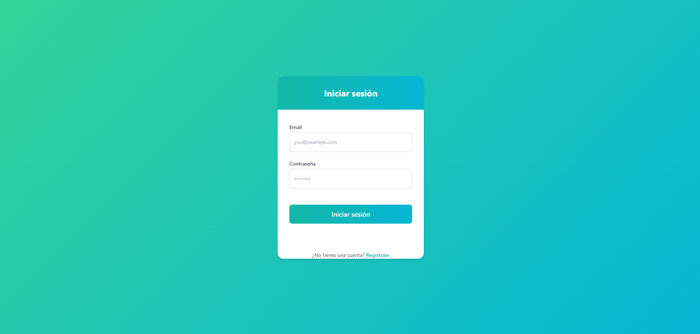
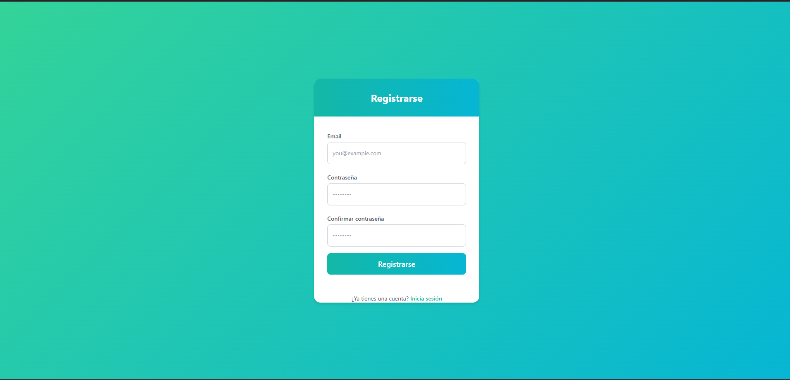
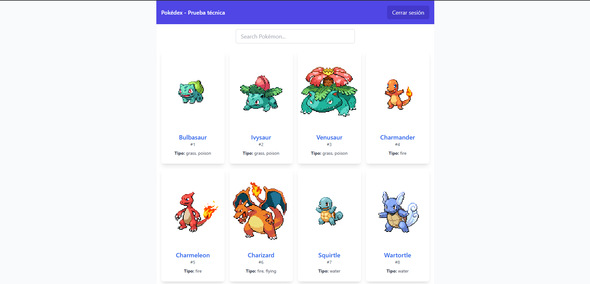
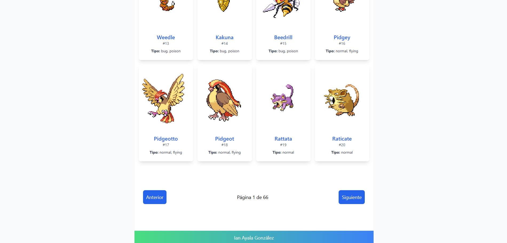

# Laravel + React + Sanctum Authentication
### Por: Ian Ayala González

Este proyecto consiste en una aplicación con **Laravel** en el backend y **React** en el frontend, utilizando **Sanctum** para la autenticación con tokens.

### Backend (Laravel)
1. **Configurar la base de datos** en el archivo `.env`.
2. **Ejecutar migraciones** para crear la tabla de usuarios.
3. **Instalar y configurar Sanctum** para autenticación basada en tokens.
4. **Definir rutas de API** para el registro, login y logout de usuarios.
5. **Configurar CORS** para permitir la comunicación con el frontend.

### Rutas:


### Frontend (React)
1. **Instalar dependencias**: `pnpm`, `vite`, `react-router-dom`, `axios`, `tailwindcss`.
2. **Configurar rutas** para las páginas de login y home.
3. **Crear formulario de login** para que el usuario ingrese sus credenciales y obtenga un token de autenticación.
4. **Consumir la PokéAPI** en la página de inicio, mostrando una lista de Pokémon.
5. **Implementar logout**, eliminando el token de `localStorage` y redirigiendo al login.

### Instalación

#### Backend (Laravel)
1. Clonar el repositorio.
2. Instalar las dependencias de Laravel:
    ```bash
    composer install
    ```
3. Crear un archivo `.env` en la raíz del proyecto y configurar la conexión a la base de datos.
4. Generar la clave de la aplicación:
    ```bash
    php artisan key:generate
    ```
5. Ejecutar las migraciones para crear las tablas de la base de datos:
    ```bash
    php artisan migrate
    ```
   
#### Frontend (React)
1. Ejecutar pnpm para instalar las dependencias:
    ```bash
    pnpm install
    ```
2. Ejecutar el servidor y cliente de desarrollo:
    ```bash
    pnpm run prod
    ```
3. Acceder a la aplicación en `http://localhost:8000`

### Capturas de Pantalla





